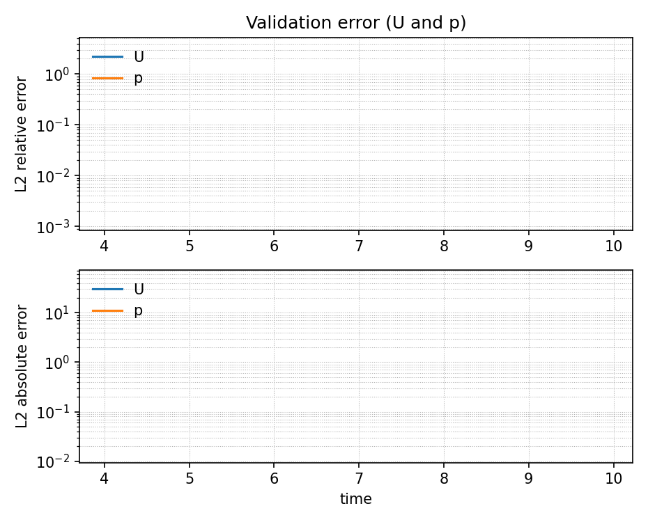
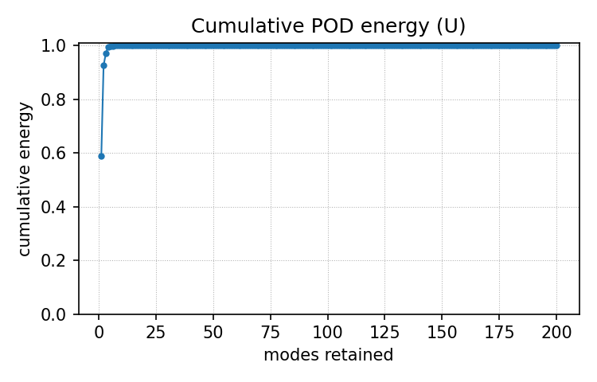

# Adaptive Model Reduction (OpenFOAM + ROM)

This repository contains an adaptive reduced-order modeling (ROM) workflow for unsteady OpenFOAM CFD cases. The pipeline alternates between a full-order model (FOM) and a ROM based on an error trigger, and includes scripts to generate snapshots, fit a POD/OpInf ROM, run adaptive simulations, and post-process force coefficients.

## Repository layout

- `cases/`: base, low-fidelity, and high-fidelity OpenFOAM cases.
- `rom/`: ROM configs and Python modules (POD, OpInf, adaptive driver, metrics).
- `scripts/`: milestone scripts to run the pipeline end-to-end.
- `results/`: logs and post-processed outputs (figures, tables, CSVs).
- `references/`: reference PDFs (user-provided).
- `tests/`: small validation tests for CSV outputs.

## Requirements

- OpenFOAM 13 (or compatible), with `blockMesh`, `foamRun`, `foamToVTK`, and your solver.
- Python 3 with `numpy`, `scipy`, `pandas`, `matplotlib`, and `PyYAML`.
- Optional: ParaView (`pvpython`) for snapshot rendering helpers.

The scripts assume a venv at `/home/kalel1938/venvs/myenv`. Update the `VENV_ACTIVATE` path in `scripts/*.sh` for your environment.

## Quick start

```bash
source /path/to/OpenFOAM-13/etc/bashrc
source /path/to/venv/bin/activate

bash scripts/00_env_check.sh
bash scripts/01_get_case.sh
```

If `scripts/01_get_case.sh` needs a different tutorials directory, set `FOAM_TUTORIALS` or `TUTORIALS_ROOT` before running.

## Full workflow (recommended order)

```bash
# Low-fidelity FOM + ROM build + adaptive run
bash scripts/02_run_fom_low.sh
bash scripts/03_build_rom_low.sh
bash scripts/04_run_adaptive_low.sh

# High-fidelity FOM + adaptive run
bash scripts/05_run_fom_high.sh
bash scripts/06_run_adaptive_high.sh

# FOM-only reference runs
bash scripts/08_run_fom_only_low.sh
bash scripts/09_run_fom_only_high.sh

# Post-process force coefficients
bash scripts/10_postprocess_coeffs_low.sh
bash scripts/11_postprocess_coeffs_high.sh
```

Logs are written to `results/logs/`. Output artifacts land in `results/low/` and `results/high/`.

## Results

### Adaptive model timelines

Low fidelity:


High fidelity:


### Validation errors

Low fidelity:



High fidelity:


### ROM basis energy (low fidelity)



### Force statistics

| case | source                      | Cd_mean | Cl_rms | f_peak_Hz | St                      | beta |
| ---- | --------------------------- | ------- | ------ | --------- | ----------------------- | ---- |
| low  | FOM-only                    | 10.12   | 2.233  | 0.1604    | 0.3209                  | 0.5  |
| low  | adaptive (FOM segments)     | 9.608   | 1.636  | 0.1604    | 0.3209                  | 0.5  |
| low  | ROM intervals (postProcess) | 9.654   | 0.5895 | 0.1604    | 0.3209                  | 0.5  |
| high | FOM-only                    | 9.84    | 2.065  | 0.2817    | 0.56338028 (indicative) | 0.5  |
| high | adaptive (FOM segments)     | 9.371   | 0.2367 | 0.2817    | 0.56338028 (indicative) | 0.5  |
| high | ROM intervals (postProcess) | 6.634   | 0.8137 | 0.2817    | 0.56338028 (indicative) | 0.5  |

### Runtime summary

| case | adaptive_total_s | fom_only_wall_s | ratio_fomonly_over_adaptive | label    |
| ---- | ---------------- | --------------- | --------------------------- | -------- |
| low  | 71.32            | 34.13           | 0.4786                      | slowdown |
| high | 64.83            | 10.35           | 0.1597                      | slowdown |

## Tests

```bash
python -m pytest tests
```

## Notes

- `results/low/rom/` contains POD/ROM diagnostics (energy, singular values, errors).
- `results/*/metrics/` contains runtime summaries and error time series.
- `results/*/adaptive/` includes model-switching timelines and validation plots.
